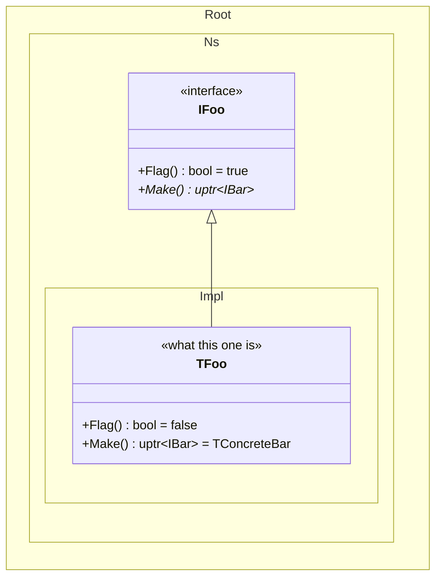

# Mermaid class hierarchy diagrams

Scope: one base class or interface and the classes deriving from it. The reader's question is "what do the subclasses change". Everything below serves that.

## Namespaces

One `namespace` block per real namespace, dotted and fully qualified. Dots make Mermaid nest the groups; underscores do not.

```
namespace NKikimr.NOlap.NReader.NSimple.NSysView.NChunks {
```

Never truncate or abbreviate the path.

## Class ids and labels

Class ids must be globally unique — Mermaid cannot resolve `Namespace.Class` in relations. When the same class name appears in several namespaces, prefix the id and restore the real name with a label:

```
class Chunks_TAccessor["TAccessor"] {
```

Relations then use the bare prefixed id:

```
Abstract_TAccessor <|-- Chunks_TAccessor
```

## Never use `note for`

Notes render far away from their class and are useless. Put everything inside the box:

- `<<...>>` annotation for the one-line "what is this": mapped table, role, stereotype
- members for behaviour

## Members carry both type and value

The text after `()` is free-form. Show the exact type, then the concrete value or default. This is what makes a diagram informative at a glance.

```
+OrderByLimitAllowed() bool = true
+GetOverridenScanType() TString = SIMPLE
+GetShardingInfo() opt~TGranuleShardingInfo~ = nullopt
+SelectMetadata() uptr~ISourcesConstructor~ = NChunks.TConstructor
```

When an override returns a concrete implementation of an interface, name the implementation. `= TConcreteConstructor` is useful; the bare interface name is not.

Mark pure virtuals with `()*`:

```
+SelectMetadata()* uptr~ISourcesConstructor~
```

## Marking anomalies

When a value reflects something under investigation that will likely be changed, mark it in the text, not only in the styling:

- `BUG:` prefix for a confirmed defect
- `TODO:` prefix for something that needs a decision

```
+GetStartPKRecordBatch() TSimpleRow = BUG: always min key, ctor already swapped
+GetChunksPKOrder() TPKSortPermutation = TODO: gated on pushdown flag, not on IsSorted
```

Outline the class too:

```
style Abstract_TSourceData stroke:#d33,stroke-width:3px
```

Never set `fill` — it breaks under light/dark theme switching. Stroke only, and no icons in the label. The text prefix is the durable marker; styling is a convenience on top.

Only mark what has been established. A suspicion that has not been traced to code does not get a marker.

## Accuracy

Read the implementation files for the actual returned values before writing them down.

Do not show members on one subclass as an example and leave its siblings empty. If five subclasses override the same methods, show all five — identical boxes are information, not noise.

Avoid domain jargon in the value slot. Prefer `= own fixed schema` over `= ChunksPreset.LastSchema` unless the reader is known to already know the term.

## Abbreviations

`uptr`, `sptr`, `opt`. Generics via `~ ~`, never `<>`.

## Syntax pitfalls

Edge labels must not contain a colon. The first `:` is the label separator, a second one is a parse error:

```
A ..> B : builds it, BUG - drops the flag
```

Use a dash, not `BUG:`, in edge labels. Inside a class body the `BUG:` prefix is fine.

One `<<...>>` annotation per class. A second one is not a second line of description.

## Skeleton



## Compatibility

Class labels require Mermaid 10.7 or newer. If the renderer rejects them, drop the `["Name"]` part and the prefixed ids show instead.
